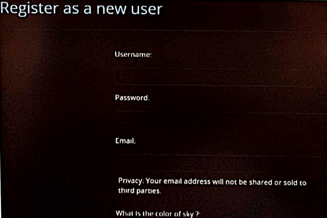
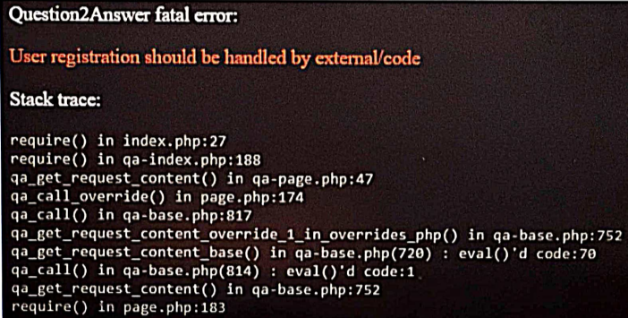

# Internship work
 - Worked on the Design and Development part of a fully responsive webpage for a particular sectionof ITJOBXS.

- Enhanced website by Integrating GooglereCAPTCHA for an additional layer of protection , significantly decreasing thenumber of bot-based interactions by 95%
- Executed user verification/authentication mechanisms, effectively reducing fake bot registrations and spam posts by 90%

## Screenshots

## Tech stack

- HTML
- CSS
- PHP
- JavaScript
- Bootstrap
- MySql

